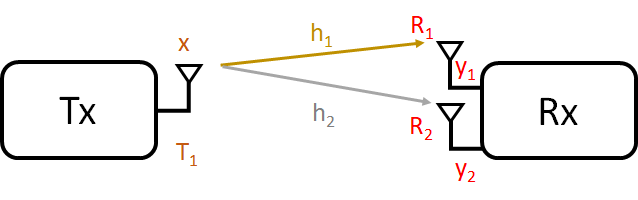
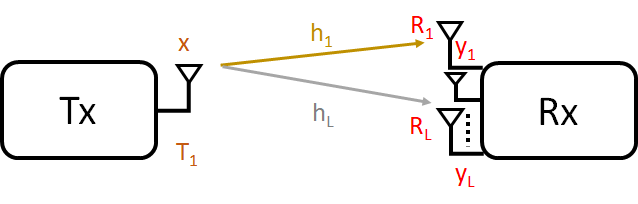
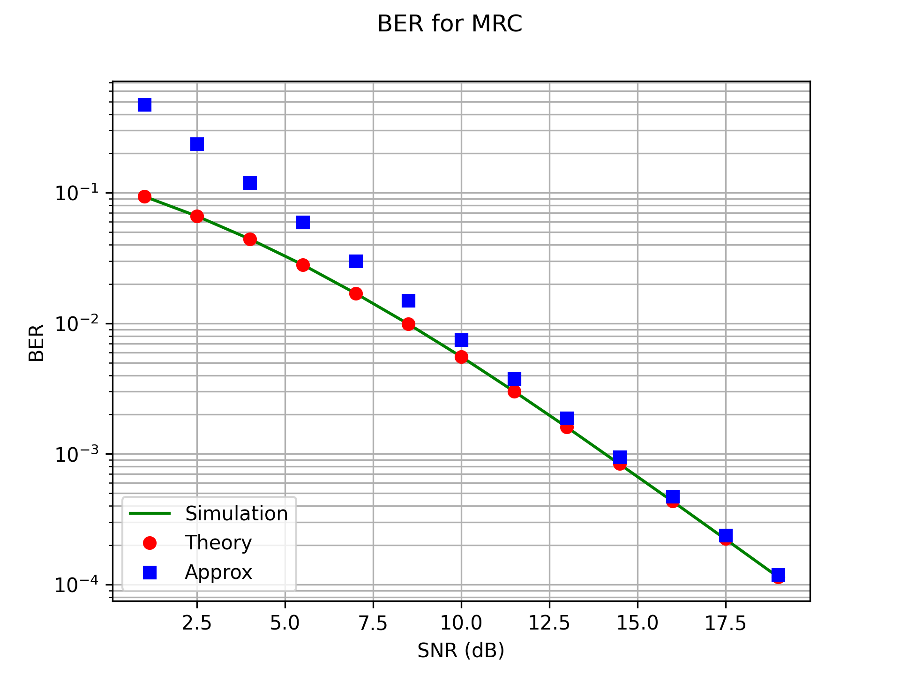

# Performance Analysis for Communication Systems 

The poor performance of the wireless communication system can be attributed to the deep fading events occuring because of the fading nature of the wireless channel.
To overcome this deep fade effects, we use the diversity principle.

In this project, we will present the diversity principle to combat fading and more precisely to overcome effects of the deep fade. Moreover, we simulate using Python this system model
and we present its bit error rate performance.

The project report contains the definition and the expression of : 
* [Princile of Diversity ](#Princile-of-Diversity)
* [Maximum Ratio Combiner to L Antennas](#Maximum-Ratio-Combiner-to-L-Antennas)
* [BER of Multiple Antenna Wireless Systems](#BER-of-Multiple-Antenna-Wireless-Systems)
* [Average BER](#Average-BER)

## Princile of Diversity

Traditionnaly, we have a single link between the transmitter and the receiver. If this link is in a deep fade, then there is no path to transmit the signal and it disrupts the communication.
In this case, there is not alternative link which is not fading to transmit the signal between the transmitter and the receiver. Therefore, the performance of the communication is bad.
To improve the performance of the wireless communication system, it is necessary to consider a system with multiple links between the transmitter and the receiver.
In the figure bellow, we present a scenario of a system with multiple links. In such a case, the communication is not disrupted thank to the diversity principle as there is some alternative paths.

Diversity is a key concept and there are many different forms of diversity (temporal diversity, frequency diversity, multi-user diversity) and one can exploit diversity to improve the wireless system performance.

### Model of Multiple Receive Antenna

The figure of multiple receive antenna is depicted bellow.

Where x is the transmitted symbol, h1 is the fading coefficient between T1 and R1, h2 is the fading coefficient between T1 and R2, y1 is the symbol received in R1, y2 is the symbol received in R2.
Hence, the system can be modeled by:

where n_1 is the noise at receiver R_1, n_2 is the noise at receiver R_2. n_1 and n_2 are Gaussian, whith zero mean and each with power sigma2. n_1 and n_2 are considered uncorrelated meaning:
We suppose that the channel coefficients h_1 and h_2 are real quantities.

The system can be written by:

At the receiver, we have a combined version of the two received symbols as:

The SNR in such a system is then given by:

The noise power is expressed as follows:
%5E2%20%5C%7D%20=%20w_1%20E%5C%7B%20n_1%5E2%20%5C%7D%20&plus;w_2%20E%5C%7B%20n_2%5E2%20%5C%7D%20&plus;2%20w_1w_2%20E%5C%7B%20n_1%20n_2%20%20%5C%7D%20=%20(w_1%5E2&plus;w_2%5E2)%20%5Csigma%5E2%20=%20%5Cbegin%7BVmatrix%7D%5Cbar%7Bw%7D%5Cend%7BVmatrix%7D%5E2%5Csigma%5E2%20)

Then the SNR is: 
%5E2%7D%7B%5Csigma%5E2%20%7D)

The SNR is maximum when cos is 1 or w has to be along with h.

Hence , one can choose w like:

and for complex coefficients, the combined signal at the receiver can be given by: 

and the maximal ratio combiner w which maximize the SNR can be given by

## Maximal Ratio Combining of L Antenna

The system of maximal ratio combining of L antenna is depicted in the figure bellow:

The channel coefficients in this case are: h1, h2, ..., hL.

For maximum signal to noise power ratio, choose MRC as:

)

## BER of Multiple Antenna Wireless Systems

SNR for MRC : 

)

Let's denote )

further, it is assumed that the channel coefficients are independent random variable and identically distributed (iid) rayleigh channel fading coefficients which average power
are equal to one. Hence, g is also a random variable is given as a chi-squared random variable with 2L degrees of freedom.

The received SNR after maximal ratio combining is then given by:

From previous BER analysis, we have seen that:

As g is a random variable, it is necessary to apply an average with respect to g to derive the avreage BER of the multiantenna system.

## Average BER

Therefore, average BER is given by
%5EL%20%5Csum_%7Bl=0%7D%5E%7BL-1%7D%20c%5E%7BL&plus;l-1%7D_l(%5Cfrac%7B1&plus;%5Clambda%7D%7B2%7D)%5El)

Through our simulation using Python, the resulted BER curve against the theoretical probability of error is depicted in the figure below: 

